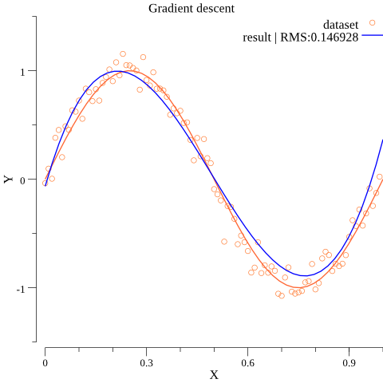
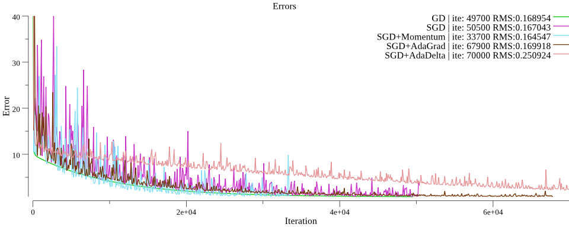

# Gradient descent in Golang

The sample implementaion of gradient descent in Golang.

- Polynomial regression
- Training set from sine function



## Usage

```sh
$ go run cmd/gradient_descent/main.go -eta 0.075 -m 3 -epoch 40000 -algorithm sgd -momentum 0.9
```

## Algorithms and optimization methods.

- Gradient descent
- Stochastic gradient descent (SGD)
- Mini-batch SGD
- Momentum
- AdaGrad
- AdaDelta

### Compare



## Contribution

1. Fork it
2. Create a feature branch
3. Commit your changes
4. Rebase your local changes against the master branch
5. Run test suite with the `go test ./...` command and confirm that it passes
6. Run `gofmt -s`
7. Create new Pull Request

## License

[MIT](https://github.com/monochromegane/gradient_descent/blob/master/LICENSE)

## Author

[monochromegane](https://github.com/monochromegane)

